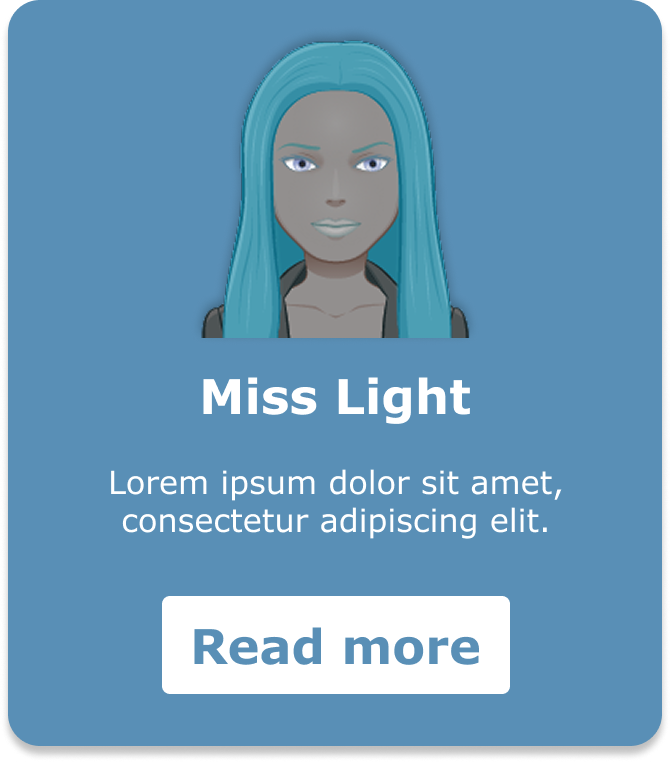

Consulter la [version markdown de cette démo]({{ site.baseurl }}/demo/README.md) pour voir le code complet et expérimenter dans le playground intégré.
{: .alert-info }

## Consigne

Tu dois intégrer en HTML et CSS la carte de profil ci-dessous. La carte contient :

- Une photo de profil (illustration)
- Un nom et un titre
- Une courte description
- Un bouton d'action

> **Objectif :** Produire un HTML sémantique et un CSS fidèle à la maquette, sans utiliser de framework.

## Maquette

### Style guide de la maquette
- Background color: `#598FB6`
- Font family: `Verdana, sans-serif`
- Card width: `300px`
- Image: `./miss-light.png`

## Étapes

1. Commence par créer la structure HTML de la carte en utilisant des éléments sémantiques (ex : `<article>`, `<header>`, `<section>`, etc.).
2. Ensuite, applique les styles CSS pour correspondre à la maquette : couleurs, typographie, espacements, etc.

## Ressource vidéo

Regarde cette vidéo pour voir les bases de l'intégration HTML/CSS :

## Critères d'évaluation
- [x] Le rendu est fidèle à la maquette (couleurs, typographie, espacements)
- [x] Le HTML est sémantique et structuré
- [x] Le CSS est organisé et utilise des sélecteurs appropriés
   
**Bonus**
- [x] Dees variables CSS sont utilisées pour les couleurs, les polices et les espacements
- [x] Un clic sur le bouton "Read more" déclenche une alerte JavaScript

## Solution

Afficher la solution (cliquer pour ouvrir)

Voici le code complet de la carte intégrée. Tu peux le modifier et expérimenter dans le playground ci-dessous.


<article>
    
    <h2>Miss Light</h2>
    
Lorem ipsum dolor sit amet consectetur adipisicing elit.

    <a href="https://example.com">Read more</a>
  </article>



article {
  background-color: #598FB6;
  color: white;
  border-radius: 8px;
  padding: 16px;
  max-width: 300px;
  text-align: center;
  font-family: Verdana, sans-serif;
  box-shadow: 0 4px 8px rgba(0, 0, 0, 0.5);
}

article img {
  width: 160px;
  filter: drop-shadow(0px -2px 6px rgba(0, 0, 0, 0.3));
}

article a {
  display: inline-block;
  margin-top: 12px;
  padding: 8px 16px;
  background-color: #FFFFFF;
  color: #598FB6;
  text-decoration: none;
  border-radius: 4px;
  font-weight: bold;
}



document.querySelector('article a').addEventListener('click', function (event) {
  event.preventDefault();
  alert('Read more clicked!');
});




